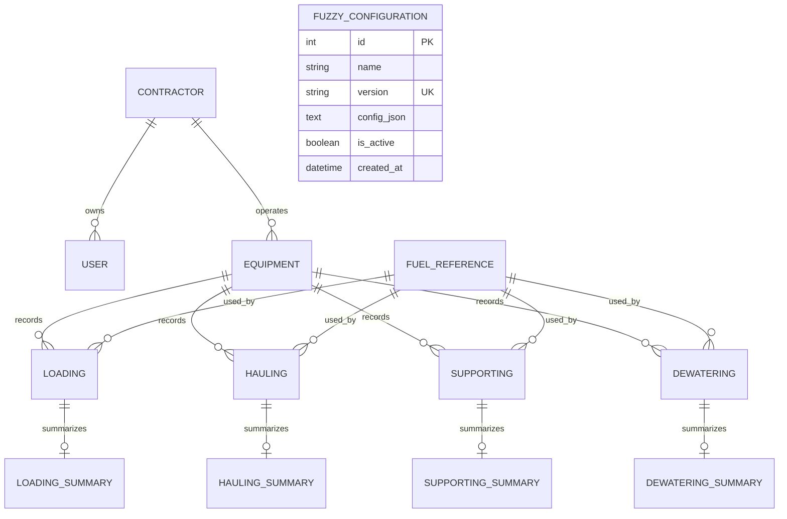

# Data Dictionary dan ERD

Dokumen ini merangkum tabel pada `backend/app/models/`, relasi, aturan field, dan sumber data. Nama kolom database menggunakan `snake_case`; response monitoring dapat menggunakan `camelCase` sesuai schema Pydantic.

## ERD

## Tabel dan field

### `contractor`

| Field | Tipe | Null | Aturan |
|---|---|---|---|
| `id` | Integer | Tidak | Primary key |
| `code` | String | Tidak | Unik |
| `company_name` | String | Tidak | Nama perusahaan |
| `status` | String | Tidak | Umumnya `active`/`inactive` |
| `created_at` | DateTime | Ya | Server default |
| `updated_at` | DateTime | Ya | Server default/on update |

### `user`

| Field | Tipe | Null | Aturan |
|---|---|---|---|
| `id` | Integer | Tidak | Primary key |
| `contractor_id` | Integer FK | Ya | Null untuk user tingkat sistem |
| `username` | String | Tidak | Unik |
| `password_hash` | String | Tidak | Hash password; authentication belum aktif |
| `role` | String | Tidak | `super_admin`, `contractor_admin`, `viewer` |
| `created_at` | DateTime | Ya | Server default |

### `equipment`

| Field | Tipe | Null | Aturan |
|---|---|---|---|
| `id` | Integer | Tidak | Primary key |
| `contractor_id` | Integer FK | Tidak | Contractor pemilik/operator |
| `unit_type` | String | Tidak | Contoh `EX26007`, `HD7857` |
| `item` | String | Tidak | Nama atau kategori alat |
| `activity` | String | Tidak | `Loading`, `Hauling`, `Supporting`, `Dewatering` |
| `qty` | Integer | Tidak | API mengharuskan `> 0` |
| `productivity` | Float | Ya | BCM/hr; dapat null untuk Supporting/Dewatering |
| `created_at` | DateTime | Ya | Server default |
| `updated_at` | DateTime | Ya | Server default/on update |

### `fuel_reference`

| Field | Tipe | Null | Aturan |
|---|---|---|---|
| `id` | Integer | Tidak | Primary key |
| `merk` | String | Tidak | Merk equipment |
| `type` | String | Tidak | Model/tipe reference |
| `activity` | String | Tidak | Aktivitas yang sesuai |
| `average` | Float | Tidak | L/jam, `> 0` |
| `low` | Float | Tidak | Nilai rendah, `> 0` |
| `mid` | Float | Tidak | Nilai tengah, `> 0` |
| `high` | Float | Tidak | Nilai tinggi, `> 0` |
| `created_at`, `updated_at` | DateTime | Ya | Audit waktu |

### `hauling_distance_ref`

| Field | Tipe | Null | Aturan |
|---|---|---|---|
| `id` | Integer | Tidak | Primary key |
| `km` | Float | Tidak | Unik |
| `load_time` | Float | Tidak | Waktu loading |
| `haul_time` | Float | Tidak | Waktu hauling |
| `dump_time` | Float | Tidak | Waktu dumping |
| `return_time` | Float | Tidak | Waktu kembali |
| `cycle_time` | Float | Tidak | Total cycle time |
| `bcm_per_hr` | Float | Tidak | Produktivitas acuan |
| `created_at` | DateTime | Ya | Server default |

## Relasi transaksi

Semua tabel transaksi memiliki `equipment_id` dan `fuel_reference_id`. Setiap transaksi memiliki summary satu banding satu melalui foreign key unik:

| Transaksi | Summary | Field khusus |
|---|---|---|
| `loading` | `loading_summary` | actual fuel dan operating hours |
| `hauling` | `hauling_summary` | distance km |
| `supporting` | `supporting_summary` | PA, UA, EWH, mine production |
| `dewatering` | `dewatering_summary` | PA, UA, EWH, mine production |

Field umum summary:

- `fuel_cons` atau `fuel_cons_lhr` — konsumsi fuel yang dipakai dalam perhitungan.
- `productivity` — output BCM/jam atau BCM sesuai konteks.
- `fuel_ratio` — fuel ratio hasil kalkulasi.
- `data_source` — `OEM_REFERENCE` atau `OPERATIONAL_ACTUAL`.
- `created_at` — waktu summary dibuat.

Supporting dan Dewatering juga menyimpan `fuel_cons_reference`, `fuel_cons_actual`, `fuel_ratio_reference`, dan `fuel_ratio_actual` untuk membedakan nilai standar dengan actual.

## `fuzzy_configuration`

| Field | Tipe | Aturan |
|---|---|---|
| `id` | Integer | Primary key |
| `name` | String | Default `contractor_fuel_ratio_mamdani` |
| `version` | String | Unik, contoh `2026.08.1` |
| `config_json` | Text | Membership, threshold, dan metode inferensi |
| `is_active` | Boolean | Konfigurasi aktif |
| `created_at` | DateTime | Waktu registrasi |

## Sumber data

| Sumber | Isi |
|---|---|
| `backend/data/Contractor - Sheet1.csv` | Contractor |
| `backend/data/Equipment - Sheet1.csv` | Equipment dan activity |
| `backend/data/Ref Fuel - Sheet1.csv` | Fuel reference |
| `backend/data/Hauling Distance Ref - Sheet1.csv` | Jarak, cycle time, BCM/hr |
| `backend/data/Supporting - Sheet1.csv` | Data Supporting |
| `backend/data/Dewatering - Sheet1.csv` | Data Dewatering |
| `backend/frms.db` | SQLite runtime database |

Seeder bersifat destruktif untuk database demo karena menjalankan `drop_all()` sebelum `create_all()`.
