# User Flow per Fitur

Dokumen ini menjelaskan alur pengguna pada MVP dan alur API yang menjadi dasar halaman lanjutan.

Legenda: `[User]` tindakan pengguna, `[UI]` frontend, `[API]` backend, `[DB]` database, `[Decision]` percabangan.

## 1. Membuka dashboard contractor

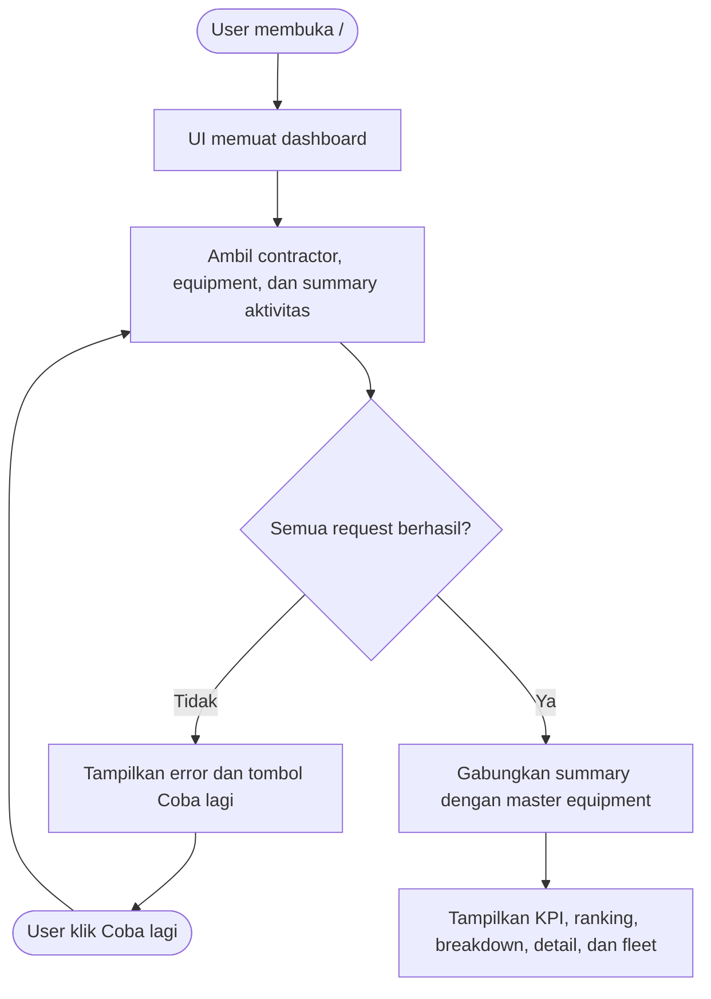

## 2. Filter contractor

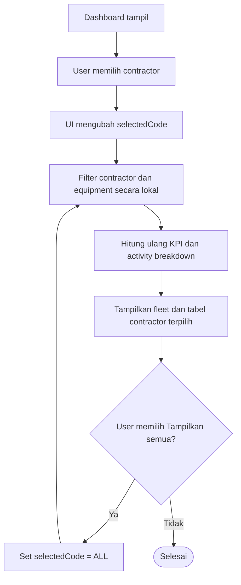

## 3. Refresh dashboard

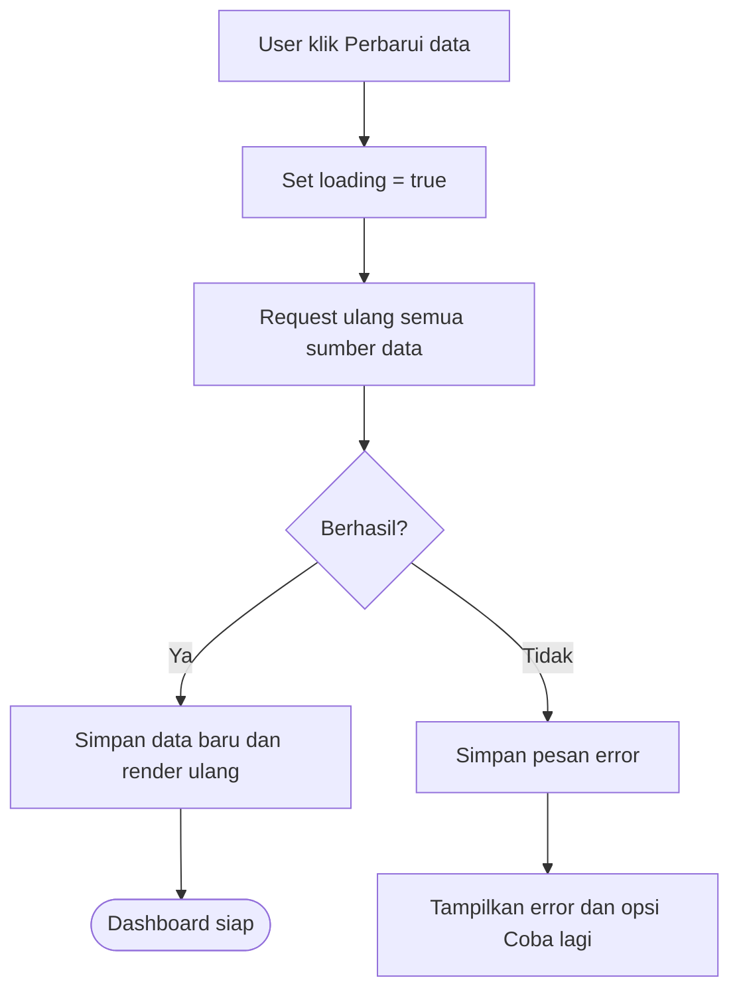

## 4. CRUD master data

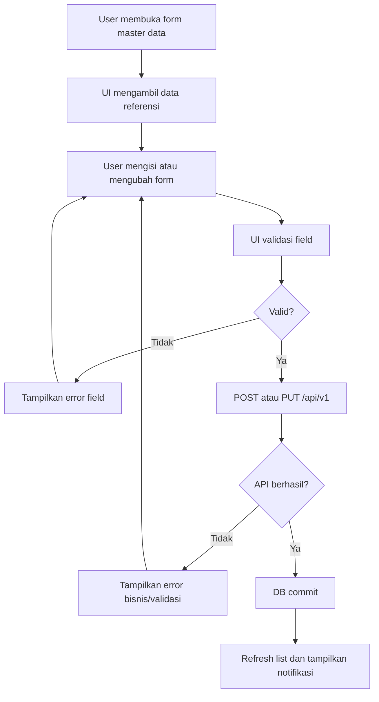

Aturan penting: contractor code harus unik, equipment quantity harus `> 0`, dan fuel reference values harus `> 0`.

## 5. Kalkulasi Loading

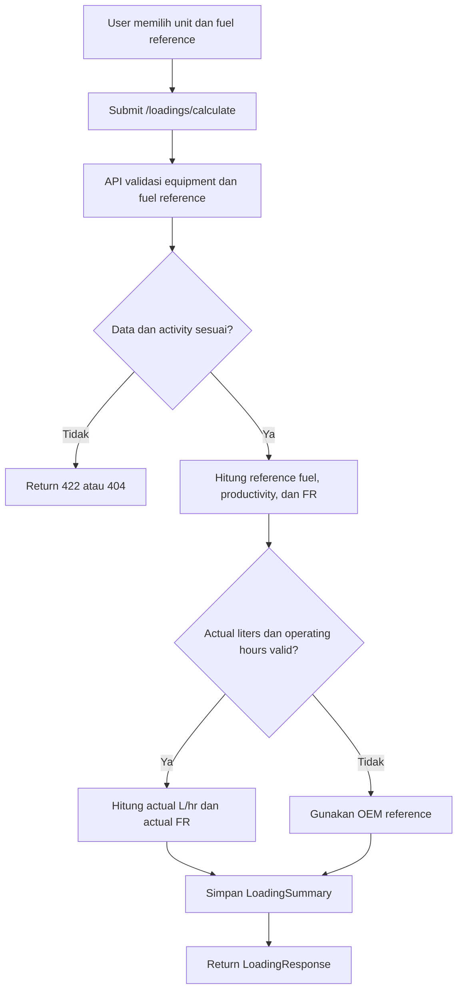

Batch Loading menerima daftar `rows` dan mengembalikan total fuel, total productivity, dan fuel ratio agregat.

## 6. Kalkulasi Hauling

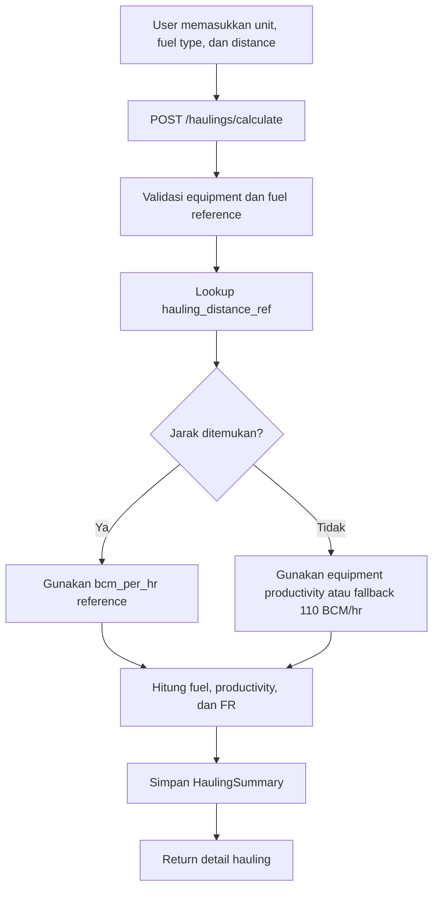

## 7. Kalkulasi Supporting/Dewatering

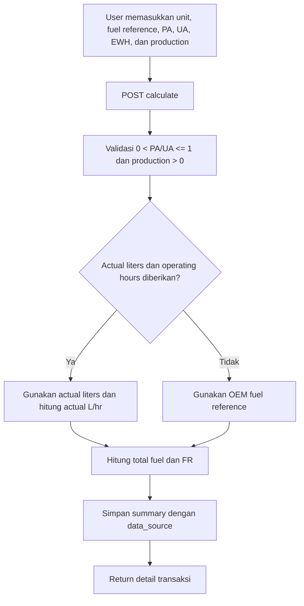

Batch `calculate-all` menjalankan flow untuk seluruh equipment dalam aktivitas terkait.

## 8. Monitoring per aktivitas dan filter

```mermaid
flowchart TD
    A[User memilih activity] --> B[UI meminta fuel-ratio/{activity}]
    B --> C[User mengisi from, to, contractor, atau unit]
    C --> D[Submit query filter]
    D --> E[API validasi aktivitas dan tanggal]
    E --> F[Filter unit berdasarkan contractor/unit]
    F --> G[Ambil trend berdasarkan created_at]
    G --> H[Batasi trend dengan from/to]
    H --> I[Hitung summary dan response]
    I --> J[UI memperbarui unit register, KPI, dan chart]
```

Filter tanggal hanya membatasi trend karena unit register belum memiliki tanggal transaksi individual.

## 9. Contractor performance dan fuzzy risk

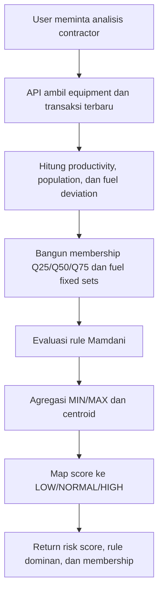

Fuzzy risk adalah sinyal prioritas, bukan keputusan otomatis untuk penalti contractor.

## 10. SPO alignment

### Summary operasional

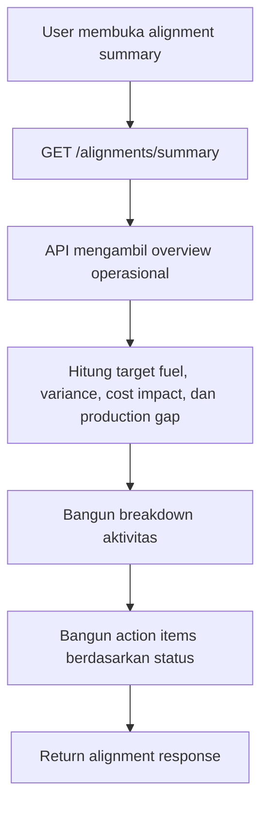

### Simulasi

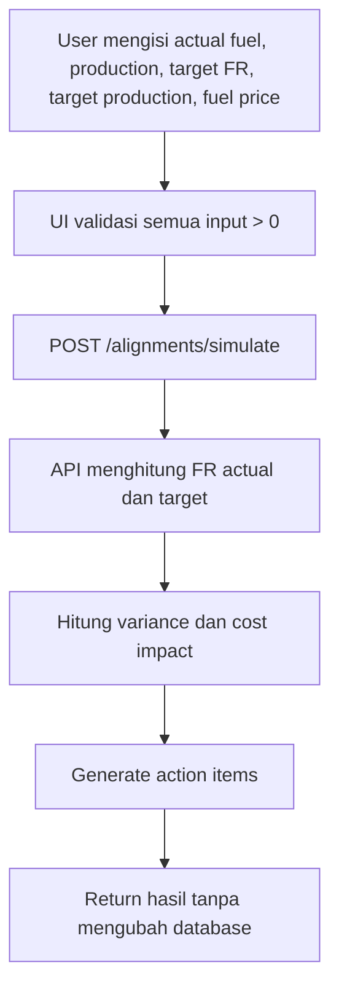

## 11. Seed dan maintenance database

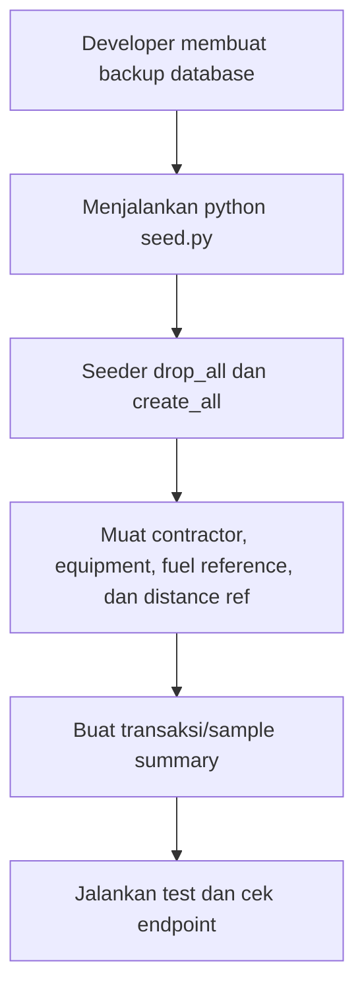

Seeder hanya untuk database demo/local karena bersifat destruktif.

## 12. State dan error yang wajib ditampilkan UI

Setiap flow frontend harus menyediakan:

- loading state saat request berjalan;
- empty state bila array kosong;
- error state untuk `404`, `409`, dan `422`;
- tombol retry untuk error network/server;
- notifikasi sukses setelah mutasi data;
- konfirmasi sebelum delete atau operasi seed.
